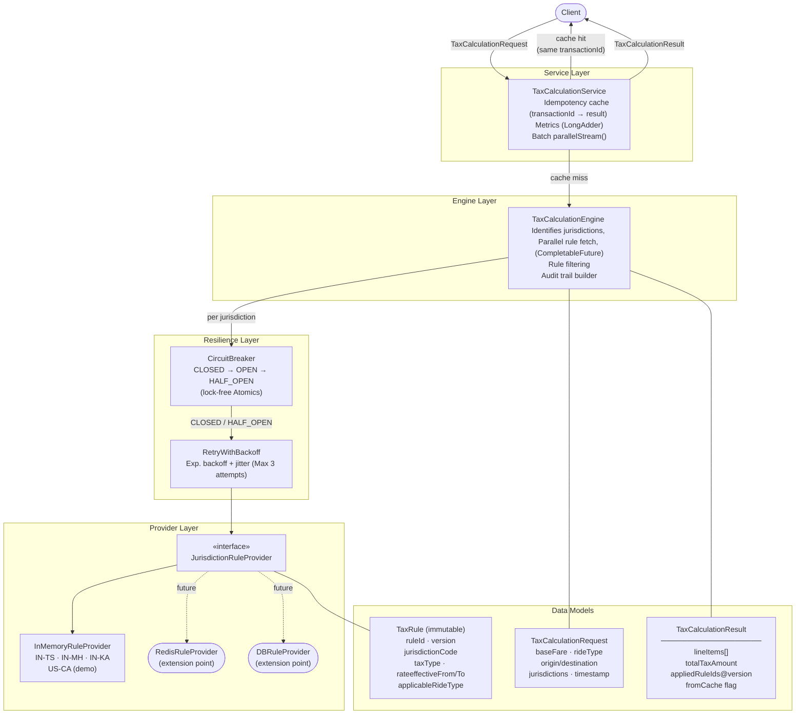
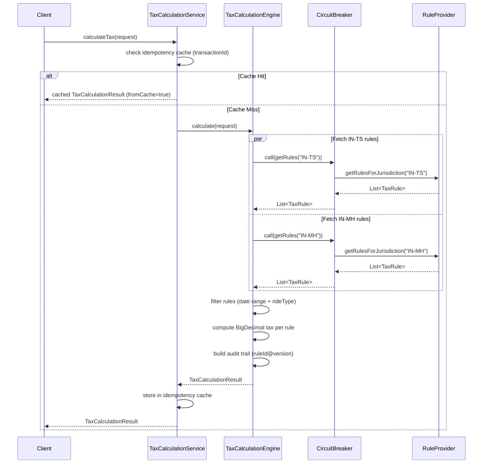
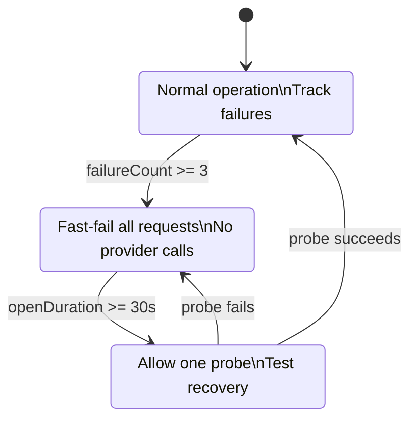

# GeoTax — High-Level Design

## Problem Statement

Ride-hailing transactions (like Uber) cross multiple tax jurisdictions with different rules (GST, VAT, CESS). GeoTax solves:

- **Accuracy**: Compute taxes with financial precision (BigDecimal, HALF_EVEN rounding per India GST guidelines)
- **Multi-jurisdiction**: A single ride may span two states, each with independent tax rules
- **Resilience**: Rule providers may be slow or unavailable; the system must not cascade-fail
- **Idempotency**: Network retries must not double-charge customers
- **Auditability**: Every result records the exact rule version applied, for compliance replay

---

## Architecture Overview

---

## Request Flow (Happy Path)

---

## Circuit Breaker State Machine

---

## Key Design Decisions

| Concern | Solution | Reason |
|---|---|---|
| Financial precision | `BigDecimal` + `HALF_EVEN` | India GST mandate; avoid float rounding errors |
| Concurrency | Immutable models + lock-free `Atomic*` | Thread-safe at 50k rides/min without locks |
| Duplicate charges | Idempotency cache by `transactionId` | Network retries must not re-bill |
| Provider failures | Circuit breaker + exponential retry | Prevent cascade failure; thundering-herd protection |
| Multi-jurisdiction latency | `CompletableFuture` parallel fetch | 100ms vs 200ms sequential for 2 jurisdictions |
| Compliance | `appliedRuleIds@version` in every result | Replay any past calculation exactly |
| Testability | `Clock` injection + provider interface | Fixed-time tests; swap real provider for mocks |
